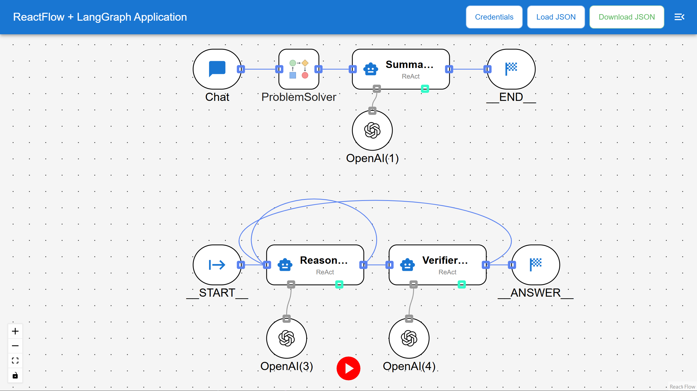
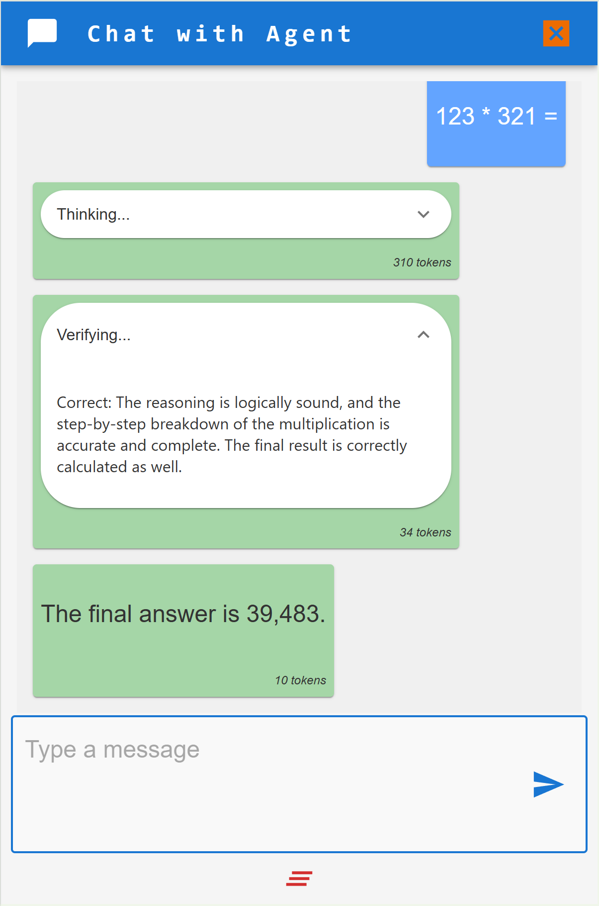

# My-LangGraph-Agent
### A Web-Based Application for Designing AI Agents Using Graphs
[](https://www.linkedin.com/in/HoHuiHsieh-607b70170/)

## Version
- **Previous version:** 0.1.0 (Graph-AI-Agent-Designer)
- **Current version:** 0.2.1

## Description
My-LangGraph-Agent is a web-based low-code platform designed to empower users to create and deploy multi-agent AI systems directly on their personal computers. It provides an intuitive interface for designing, visualizing, and managing AI workflows.

### Key Features
The application integrates three core modules:
1. **[LangGraph](https://langchain-ai.github.io/langgraphjs/):** A low-level orchestration framework for building controllable AI agents. It offers customizable architectures, long-term memory, and human-in-the-loop capabilities to tackle complex tasks reliably.
2. **[ReactFlow](https://github.com/xyflow/xyflow):** A robust library for creating interactive, node-based user interfaces (graph editors or flow editors) in React, enabling intuitive visual design of AI workflows.
3. **[Next.js](https://github.com/vercel/next.js):** A full-stack React framework that handles both the front-end and back-end aspects of web applications, enabling developers to build scalable, performant, and feature-rich applications.

**Notes:**
- This project is intended for learning purposes and as a hands-on exploration of AI agent design.
- Some development ideas and inspirations for this project are derived from [n8n](https://github.com/n8n-io/n8n), an open-source workflow automation tool.
- This project is currently under active development. Debugging and testing are ongoing to ensure stability and functionality.

## Example Images
Here are some example images showcasing the application's interface and features:

1. **Graph Editor Interface:**
   

2. **ChatRoom:**
   

   ## Example Workflow
   You can find an example workflow file in the following location: [assets/example.json](./assets/example.json)

## Installation
**Prerequisite:** This project requires a Linux (Ubuntu) environment.

1. Clone the repository:
   ```bash
   git clone https://github.com/HoHuiHsieh/Graph-AI-Agent-Designer.git
   ```
2. Navigate to the project directory:
   ```bash
   cd Graph-AI-Agent-Designer
   ```
3. Start a development container:
   ```bash
   ./start-dev.sh
   ```
4. Attach to the bash of the running Docker container:
   ```bash
   docker exec -it <container_name> /bin/bash
   ```
5. Install the required packages:
   ```bash
   npm install
   ```

## Usage
1. Attach to the bash of the running Docker container:
   ```bash
   docker exec -it <container_name> /bin/bash
   ```
2. Run the application:
   ```bash
   npm run dev
   ```
3. Access the application at `http://localhost:3000`.

## License
This project is licensed under the **GPL-3.0 License**. See the [LICENSE](LICENSE) file for details.